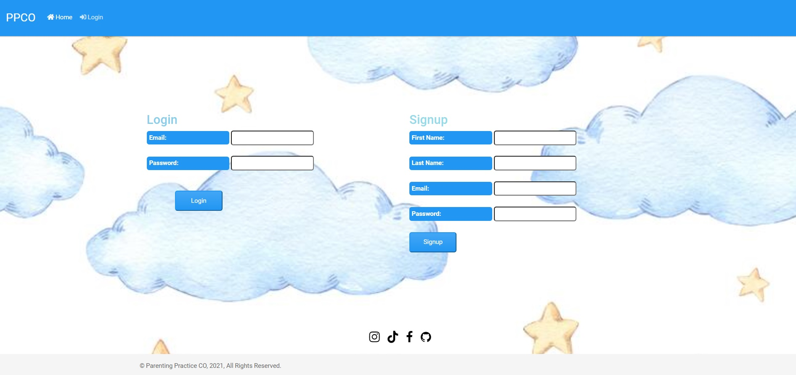
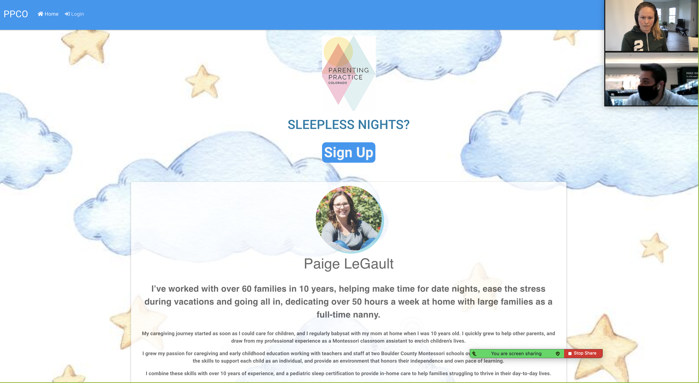

# Project-2-DU-Bootcamp

## Title: Parenting Practice Co

## Contents

1. [Technologies-Used](#Technologies-Used)
2. [Description](#Description)
3. [Deploy](#Link)
4. [Usage](#Usage)
5. [License](#License)
6. [Credits](#Credits)
7. [Questions](#Questions)
8. [Roles](#Roles)

## Technologies-Used

1. Javascript
2. Node.js
3. Node packages
   - MySQL
   - connect-session-sequelize
   - express-session
   - handlebars
   - dotenv
   - bcrypt
   - express
   - mysql2
   - sequelize
4. MySQL Database
5. Heroku / JawsDB (Database)
6. Twilio

## Description

- Created web application for a real client who is a pediatric sleep specialist. Our client was overwhelmed with using multiple applications to interact with her clients. We have solved her problems by creating one site that collects user data on a daily bases from her clients. Now she and her clients can use one platform to do a lot more.

## Deployed application link

- [Deployed Link](https://parentingpracticeco.herokuapp.com/)

## Usage

- When user goes to the webpage with given link, they will be greeted by homepage with short bio of our client.

- If the user would like to be a customer, they will have to create an account.

- As soon as account is created, they will be asked information about themselves and their child.

- They will have an access to their profile.

- User will have a sleep chart page that they will have to fill out daily.

- User is able to delete a sleep chart if they made mistakes.

- Also, users will be sent a daily text message at 8pm to remind them to log on to their page and fill out the daily sleep chart.

## License

- 

## Credits

- Created by Tolga Secme, Morgan Franke, Robert Koch, Nathan Forgille.

##  Questions

1. E-mails:

- [Tolga Secme](mailto:tolgasecme@icloud.com)
- [Nathan Forgille](mailto:nathan.forgille8@gmail.com)
- [Morgan Franke](mailto:morganleighfranke@gmail.com)
- [Robert Koch](mailto:robertwkoch@live.com)

2. Github pages:

- [Tolga Secme](https://github.com/TolgaS92)
- [Nathan Forgille](https://github.com/NathanForgille)
- [Morgan Franke](https://github.com/morganleighfranke)
- [Robert Koch](https://github.com/robwkoch)

3. Linkedin:

- [Tolga Secme](https://www.linkedin.com/in/tolgasecme/)
- [Nathan Forgille](https://www.linkedin.com/in/nathan-forgille/)
- [Morgan Franke](www.linkedin.com/in/morganfranke)
- [Robert Koch](https://www.linkedin.com/in/robert-koch-66588a20b/)

## Beginning story

- Description: We are using Rob’s wife as our client, and building her a new website that solves some of her business challenges.
- MVP: A polished website that increases her visibility online. A new client can create a new account. When creating a new account the client will be given a form to fill out that is a questionare based on the childrens needs. Each client has a sleep log that they fill out daily for our client to access the information easily.
- reach goals: Schedule reminders based on baby sleep cycle

## Roles

- PM: Morgan
- Github Guru: Tolga
- Presentation Guru: Nathan
- Readme: Tolga

- Front End: Nathan and Rob nad Tolga
- Back End: Morgan, Tolga and Rob
